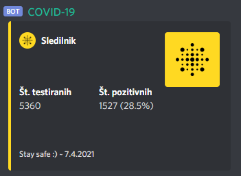

# Covid-19 Discord bot

A discord bot for daily Covid-19 reports in Slovenia

Add this bot to your server:  
https://discord.com/api/oauth2/authorize?client_id=685875831397941374&permissions=19456&scope=bot



## Setup

```bash
$ npm install
$ npm run build

$ npm run start:prod      # Linux
$ npm run start:winprod   # Windows
```

## Channel selection

You can now set a custom channel to send daily reports to.  
You will need `ADMINISTRATOR` permissions on the server.  
To set a custom channel use: `cv!channel` in the prefered channel.

## Environment Variables

Environment variables can be read from the root of the project from a `.env` file.

- `TOKEN` - bot token
- `NODE_ENV` - already set in `package.json`

* `DEV_SERVER_ID` - server id to send messages when `NODE_ENV` is set to `development`
